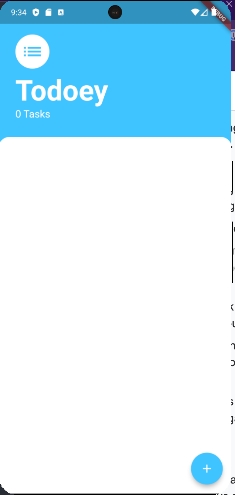
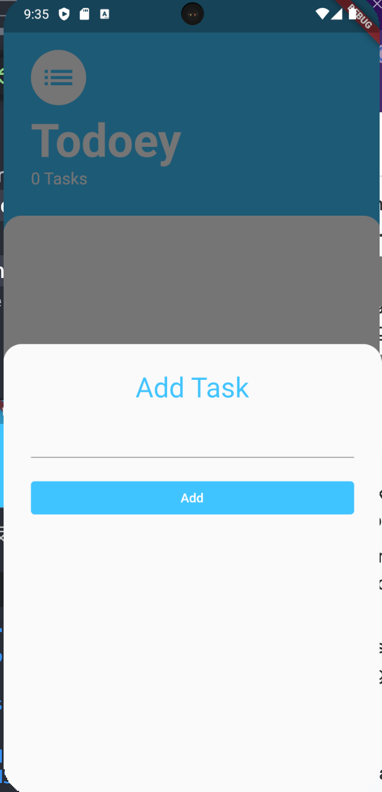
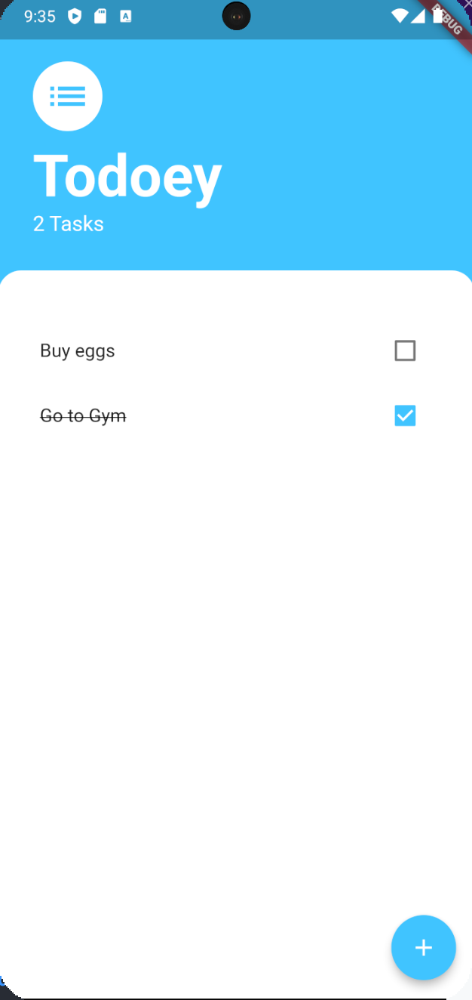

# Todoey App

### [Link to flutter tutorial](https://www.udemy.com/course/flutter-bootcamp-with-dart/?couponCode=OF53124)

## Overview:
- The todoey application is a common todo app that allows a user to record tasks that they need to accomplish and they can check off once they have completed the task. 

## What I learn about flutter/dart with project: 
- State Management
- Callbacks
- Flutter architecture patterns
- Provider package
- Listview builder

## Screenshots: 

    
    
    

## Installation/Running steps :computer: :

### Running project
- Add [Flutter](https://docs.flutter.dev/get-started/install) to your machine
- Open this project folder with Terminal/CMD and run `flutter packages get`
- Run `flutter run` to build and run the debug app on your emulator/phone
